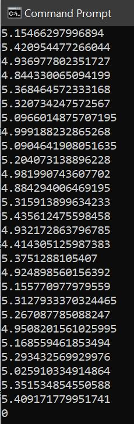

# trace_cmd_line_entropy
A python script to extract the cmd line string from the Tanium recorder, generate an entropy value, and compare that value to a threshold.

In the cyber security cat and mouse game of attackers vs defenders, attackers have been using living off the land binaries for years to accomplish their goals. In response to this, defenders have become better at detecting these attacks, looking for specific strings used by attackers.  In response to this, cmd line obfuscation frameworks (i.e. dosfuscation) and techniques were born to combat looking for known strings.  One method to detect when obfuscation is used on the cmd line is to utilize entropy to look for strings with a high degree of randomness.  

Checking for entropy is best done in a SEIM, using something like URL Toolbox in Splunk for example. For those who have Tanium, but may not have a SEIM, or do not have the budget to send their endpoint logs to a SEIM, this a method to check for high cmd line entropy using the Threat Response module and the Tanium REST API. 

The Python script starts off by asking a Tanium saved question (Trace Executed Processes) with regex to filter the results to shells (i.e. cmd, powershell, wscript… etc) and the “make stackable” option is used:

Get Trace Executed Processes[1 hour,1579804625753|1579804625753,1,0,100,1,"(?i).*(\\cmd\.exe$|\\powershell\.exe$|\\java\.exe$|\\wmic\.exe$|\\cscript\.exe$|\\wscript\.exe$|\/bash$)","","","","",""] from all machines with OS Platform equals windows

Then the cmd line string of each result is extracted and run through the shannon entropy algorithm (code borrowed from URL Toolbox) to computate an entropy value for that string.  Each entropy value is then compared to a threshold value, to determine higher than normal entropy.  I have found 5.75 to be a good threshold value to catch anything base64 encoded and above and eliminate most false positives, but your mileage may vary.

Next the script will take any results that are higher than the threshold value and ask additional questions (no make stackable option) searching specifically for the cmd line value, to gather details about the host its sourced from.  Prevention is built in to ensure the results are limited (script terminates) should there be a new false positive deployed in the environment.  The results of each question are written to a spreadsheet and the spreadsheet is emailed off. 

Due to limitations of the amount of data that can be pulled back from all endpoints, the script should be scheduled as frequently as possible to run (ideally every 30 mins) to minimize gaps, as the recorder continues to roll.  Testing and monitoring of platform health should be done in this regard to ensure there is no degradation of the Tanium server performance and things like string count don’t become an issue (depending on your hardware).  Any items you need to tune out that are false postives, can be added to your original saved question that pulls the data in.  

The script uses fernet encryption to protect the credentials, separating the key from the ciphertext. There is also a python script included for taking your base64 encoded password and generating a fernet key with ciphertext file.

Shoutout to Nathaniel (J.P.) Nieuwendam who helped me figure out the required syntax for asking a question with multiple user inputs, via the api. 

Many thanks goes out to the Tanium TAMs and the python community for all the online tutorials, whose code has been borrowed/modified to make this possible.

